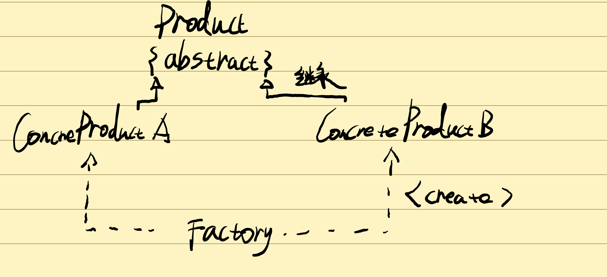

# 简单工厂模式


**简单工厂模式，定义一个工厂类。它可以更具参数的不同返回不同的参数类型，被创建的实例通常都具有共同的父类**

**简单工厂模式中创建实例的方法通常是静态方法，因此简单工厂又叫静态工厂方法模式**

##### 结构

Factory（工厂角色）工厂角色即是简单工厂模式的核心，负责实现创建所有产品实例的内部逻辑；工厂类可以直接被外界直接调用，创建所需要的对象。

Product（抽象产品角色）是工厂类创建所有对象的父类，封装了各种产品对象的公有方法。工厂类只需要定义一个通用工厂方法因为创建的具体产品都是这个类的子类

ConcreteProduct（具体产品角色）她是工厂创建的目标。所有被创建的对象都充当这个角色的某个具体类的实例。每个具体产品都继承了抽象产品角色，需要实现抽象产品中的抽象方法。


##### 实现

###### *Common通常*：



```java
public abstract class Product {
    //所有产品类的公有方法
    public void methodsSame(){
        //
        System.out.println("我是是爸爸" );
    }
    public abstract void methodDiff();
}

```

```java
public class ConcreteProduct extends Product{
    public void methodDiff() {
        //业务方法的实现
        System.out.println("我是son");
    }
}

```

```java

public class Factory {
     //  Factory（工厂角色）工厂角色即是工厂类。核心负责创建所有产品实例的内部逻辑；工厂类可以被外界直接调用，创建所需的产品对象
    //Product（抽象产品角色）：他是工厂类创建的所有对象的父类。封个种产品。
    //ConcreateProduct（具体产品角色）简单工厂创建的目标，每一个具体产品角色都继承抽象产品角色，需要实现抽象产品角色的抽象方法。
   public static Product getProudct(String arg){
       Product product=null;
       if (arg.equalsIgnoreCase("A")){
           product=new ConcreteProduct();
       }else if (arg.equalsIgnoreCase("A")){
           product=new ConcreteProduct();
       }
       return product;
   }
}

public class Clinet {
    public static void main(String[] args) {
        Product product;
        product=Factory.getProudct("A");//通过工厂类创建产品对象
        product.methodsSame();;
        product.methodDiff();
    }
}


```

###### *图表*：


```java
public abstract class Chart {
    //可以为抽象类也可以为接口
    public abstract void display();
}

```

```java
public class PieChart extends Chart{
    @Override
    public void display() {
        System.out.println("显示饼状图");
    }
    public PieChart(){
        System.out.println("创建饼状图");
    }
}


public class LineChart extends Chart{
    @Override
    public void display() {
        System.out.println("显示折线图");
    }

    public LineChart (){
        System.out.println("创建折线图");
    }
}


public class HistogramChart extends Chart{
    @Override
    public void display() {

        System.out.println("显示柱状图");
    }
   public HistogramChart(){
       System.out.println("创建柱状图");
   }
}


```

```java
public class ChartFactory {

    //工厂静态方法
    public static Chart getChart(String type){
        Chart chart=null;
        if (type.equalsIgnoreCase("histogram")){
            chart=new HistogramChart();
            System.out.println("初始化柱状图");
        }else if(type.equalsIgnoreCase("pie")){
            chart=new HistogramChart();
            System.out.println("初始化饼状图");
        }else if (type.equalsIgnoreCase("line")){
            chart=new LineChart();
            System.out.println("初始化折线图");
        }
        return chart;
    }
}

```

```java
public class Client {
    public static void main(String[] args) {
        Chart chart;
        chart=ChartFactory.getChart("line");
        chart.display();
    }
}

```

##### 优缺点

###### 优点：

1. 工厂包含必要的判断逻辑。可以决定什么时候创建哪一个产品。简单工厂实现了对象创建和使用的分离。

1. 客户端无需知道所创建的具体产品类的类名。只需知道具体产品类所对应的参数，通过简单工厂较少使用者的记忆量。

1. 通过引入配置文件。可以不修改任何客户端的代码情况下更换新增的具体产品类。


###### *缺点：*

1. 工厂类集中了所有产品的创建逻辑，职责过重，一旦不能正常工作，系统受影响。
1. 使用简单工厂势必会增加系统中类的个数增加系统的复杂读，不利于系统的扩展和维护。
1. 系统扩展困难，一旦添加新产品就不得不修改工厂逻辑，产品类多时逻辑复杂。
1. 简单工厂使用了静态工厂方法，造成工厂角色无法基于继承的等级结构。

##### 使用环境

- 工厂类负责创建的对象较少，由于创建的对象较少，不会造成工厂方法中的业务逻辑太过复杂。
- 客户端只知道传入工厂的参数，对于如何创建对象并不关心。


