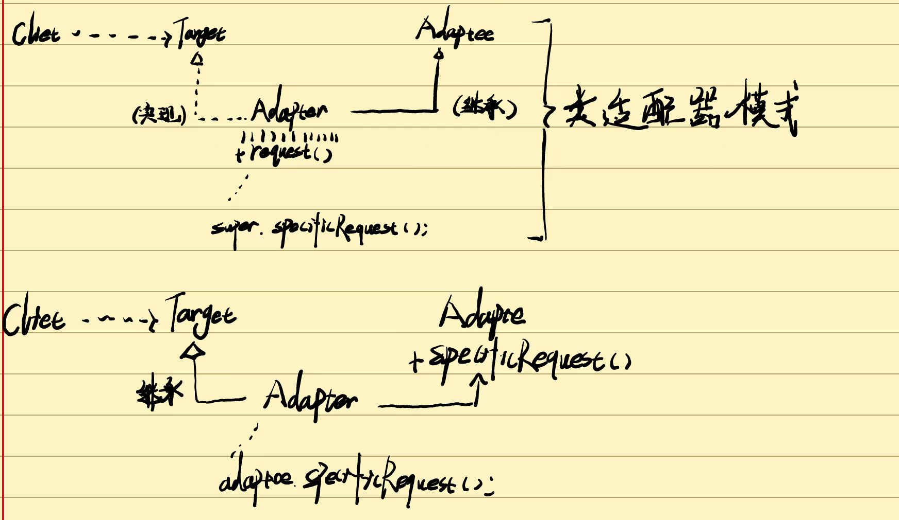
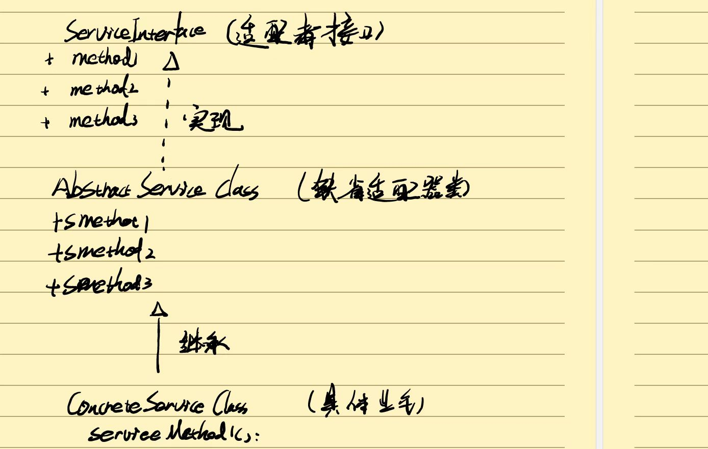
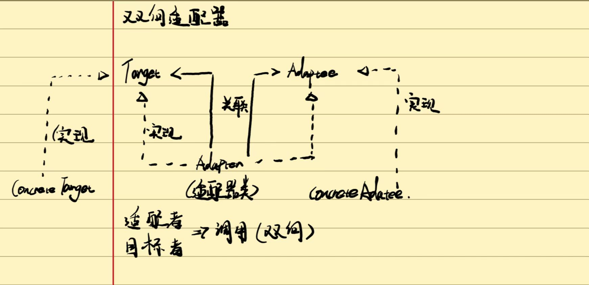

# 适配器


**适配器模式：将一个类的接口换成客户希望的另一个接口。适配器模式让那些接口不兼容的类可以一起工作**


## 适配器的结构和实现

##### 结构

目标抽象类（Target）：目标抽象类定义客户所需的接口，可以是一个抽象类或接口，也可以是一个具体类。（java语言不支持多重继承），所以这个只能是接口。


适配器（Adaapter）：可以调用另一个接口作为转换器对Adaptee（适配者）和Trage（目标类）进行适配。适配器是核心，通过实现target并继承Adaptee类来实现二者的关联。


适配者（Adaptee）被适配的角色。定义了一个已存在的接口这个接口需要适配，适配者一般是一个具体类，包含了客户的希望使用的业务方法。


##### 实现

###### **对象适配器：**



```java
public abstract class CarController {

    public void move(){
        System.out.println("玩具车在移动");
    }

    public  abstract void phonate();//发出声影
    public abstract void twinkle();//灯光闪烁

}
```

```java
//被适配类
public class PoliceLamp {
    public void alarmLamp(){
        System.out.println("呈现警灯闪烁");
    }
}

public class PoliceSound {
    public void alarmSound(){
        System.out.println("发出警笛");
    }
}
```

```java
//适配类
public class PoliceCarAdapter extends CarController {
    private PoliceLamp policeLamp;  //定义适配者policeLamp
    private PoliceSound policeSound; //定义适配者policsound

    public PoliceCarAdapter(){
        policeLamp=new PoliceLamp();
        policeSound=new PoliceSound();
    }
    //发出警笛
    @Override
    public void phonate() {
      policeSound.alarmSound();
    }
    //警灯闪烁
    @Override
    public void twinkle() {
        policeLamp.alarmLamp();
    }
}
```

###### **缺省适配器：**

当不需要实现一个接口提供的所有方法，可以设计一个抽象类实现该接口并为接口中的方法提供一个默认（实现空方法）（又称为单接口适配器模式）



```java
public interface ServiceInterface {
     //适配者接口
     void serviceMethod1();
     void serviceMethod2();
     void serviceMethod3();
}
```

```java
public abstract class AbstracServiceClass implements ServiceInterface {
    //缺省适配类
    public void serviceMethod1() {
        System.out.println("1");
    }
    public void serviceMethod2() {
        System.out.println("2");
    }
    public void serviceMethod3() {
        System.out.println("3");
    }
}
```

```java
public class ConcreteServiceClass extends AbstracServiceClass{
    
    //具体业务类
    @Override
    public void serviceMethod1() {
       // 继承重写缺省适配器的某个方法
        super.serviceMethod1();
    }

}
```

###### **双向适配器**：



```java
public interface Target {
    //目标接口
    void request();
}
//目标类实现了目标接口的方法
public class ConcreateTarget implements Target {
    @Override
    public void request() {
        System.out.println( "我是ConcreateTarget我实现了target借口的方法");
    }
}

```

```java
public interface Adaptee {
    //适配者
    void specificRequest();
}
//适配者类实现了是陪着的接口
public class ConreateAdaptee implements Adaptee {
    @Override
    public void specificRequest() {
        System.out.println("我是ConreateAdaptee我实现了Adaptee的方法");
    }
}

```

```java
public class Adapter  implements Target,Adaptee {
    //适配类实现了目标类，和适配者
    
    //关联目标类的对象
   private Target target;
    //关联被适配者的对象
   private Adaptee adaptee;

    //通过构造器给目标类夫初始化
    public Adapter(Target target){
        this.target=target;
    }
  //通过构造器给适配者
    public Adapter(Adaptee adaptee){
        this.adaptee=adaptee;
    }


    //通过创建的适配类调用specificRequest调用 target.request();
    @Override
    public void specificRequest() {
        target.request();
    }

    //通过创建的适配类调用request调用 adaptee.specificRequest();
    @Override
    public void request() {
        adaptee.specificRequest();
    }
}
```

##### 适配器的优缺点

优点：

（1）：将目标类和适配者类解耦，通过引入一个适配器来重用现有的适配类无需修改原有的结构。

（2）：增加了类的透明性和复用性，将具体业务实现过程封装在适配者类中。对于客户端是透明，提高适配者的适用性。

（3）：灵活扩展性好，通过配置可以很方便的更换适配器，可以不修改源代码的基础上增加新的适配器，完全符合开闭原则。


类适配器的缺点：

（1）：一次只能适配一个适配者类不能同时适配多个适配者

（2）：适配者不能为最终类final

（3）：类适配器模式的目标抽象类只能为接口不能为类 。

对象适配器的缺点：

（1）：要置换适配者的某些方法有些麻烦

使用环境：

系统需要使用一些现有的类的，有这些接口不符合系统的而需要

想要创建一个重复使用的类，用于一些彼此之间没有太大关联的类。