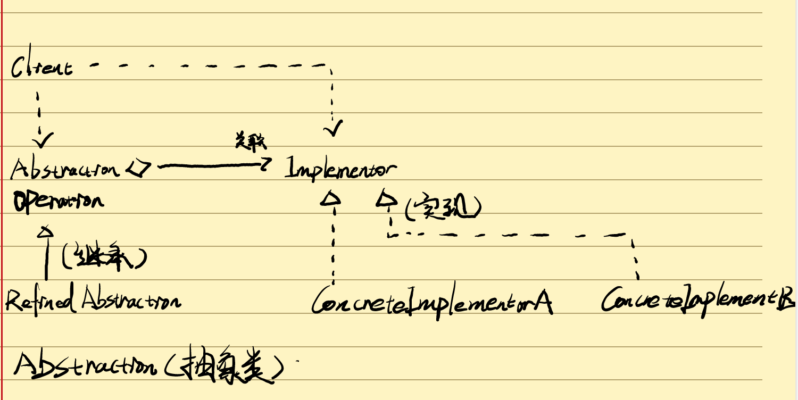
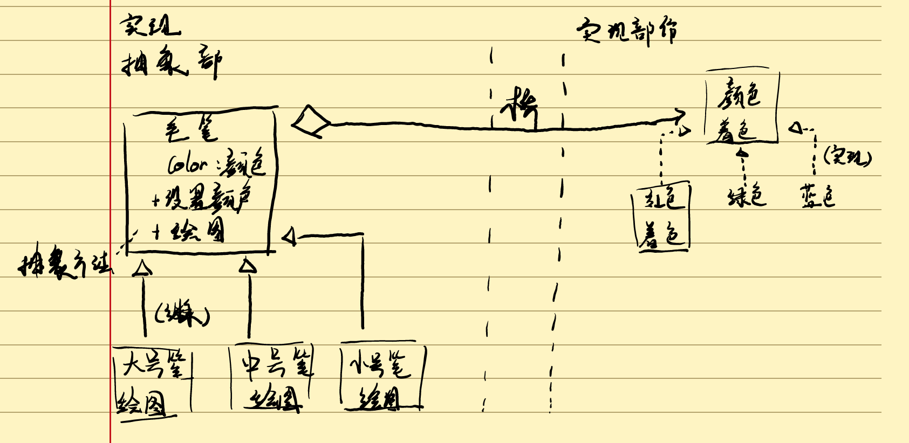
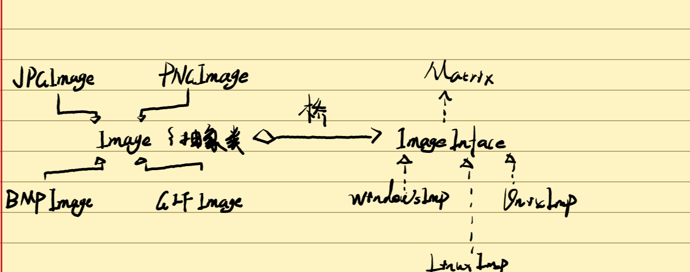

# 组合模式


**组合模式，组合多个对象形成树形结构以表示具有部分-整体关系的层次结构。组合模式让客户可以统一对待单个对象和组合对象。**

**属于对象结构型模式**

##### 结构



组合模式包含三个角色：

Component（抽象构件）：他可以是一个**接口或抽象类**，叶子构件和容器构件对象声明接口，包含**所有子类的共有行为声明和实现**。

Leaf（叶子构件）：在组合模式中表示叶子节点对象，叶子节点**没有子节点**，他实现了抽想构件中定义的行为，对于访问容器构件的方法可以**抛出异常。**

Composite（容器构件）：在组合模式中表示**容器节点对象**，容器节**点包含叶子节点**，其子节点可以是**叶子节点也可以是容器节点**。他提供一个及**集合用于存储子节点**，实现抽象构件中定义的行为，包括访问管理子构件的方法，在业务方法中使用**递归调用其子节点的业务方法**。


##### 实现

###### *常用的实现*：



```java
/**
* component(抽象构件)它可以是抽象类或接口，为叶子构件和容器构件声明的接口，在该角色中可以包含所有子类共有的声明和实现。
* */
public abstract class  Component {

    public abstract void add(Component component);
    public abstract void remmove(Component component);
    public abstract Component getChild(int i);
    public abstract void operation();

}

```

```java

/**
* leaf( 叶子构件)在组合结构中表示叶子节点对象，叶子节点没有子节点，实现了抽象构件中定义的行为。
* */
public class Leaf extends Component{
    @Override
    public void add(Component component) {
        //异常处理
    }

    @Override
    public void remmove(Component component) {
  //异常处理或错误提示
    }

    @Override
    public Component getChild(int i) {

        return null;
    }

    @Override
    public void operation() {
     //叶子构件具体业务方法的实现
        System.out.println("我是叶子构件我试一下水");

    }
}

```

```java

/**
 * Composite(容器构件)表示容器构件对象，容器节点包含子节点，提供一个集合用于存储子节点，
 * 子节点可以是叶子节点也可以容器节点，业务方中可以递归调用其子节点的业务方法
 *
 * */
public class Composite extends Component{
    private ArrayList<Component> list =new ArrayList<>();

    @Override
    public void add(Component component) {
        list.add(component);
    }

    @Override
    public void remmove(Component component) {
        list.remove(component);
    }

    @Override
    public Component getChild(int i) {
        return (Component) list.get(i);
    }

    @Override
    public void operation() {
        for (Object object : list) {
            ((Component)object).operation();
        }
    }
}

```

###### *杀毒软件的实现：



```java

//这是一个抽象构件
public abstract class AbstractFile {
    public abstract void add(AbstractFile file);
    public abstract void remove(AbstractFile file);
    public abstract AbstractFile getChild(int i);
    public abstract void killVirus();
}

```

```java

//这里充当叶子节点，叶子节点可以有多种的类型
public class ImageFile extends AbstractFile{
    private String name;

    public ImageFile(String name){
        this.name=name;
    }
    @Override
    public void add(AbstractFile file) {
        System.out.println("对不起暂时不支持增加，因为是叶子构件");
    }

    @Override
    public void remove(AbstractFile file) {
        System.out.println("对不起暂时不支持删除因为是叶子构件");
    }

    @Override
    public AbstractFile getChild(int i) {
        System.out.println("对不起暂时不支持返回因为是叶子构件，返回null");
        return null;
    }

    @Override
    public void killVirus() {
        System.out.println("现在对图片"+name+"进行杀毒");
    }
}

//这里充当叶子节点，叶子节点可以有多种的类型
public class TextFile extends AbstractFile{
    private String name;

    public TextFile(String name){
        this.name=name;
    }
    @Override
    public void add(AbstractFile file) {
        System.out.println("对不起暂时不支持增加，因为是叶子构件");
    }

    @Override
    public void remove(AbstractFile file) {
        System.out.println("对不起暂时不支持删除因为是叶子构件");
    }

    @Override
    public AbstractFile getChild(int i) {
        System.out.println("对不起暂时不支持返回因为是叶子构件，返回null");
        return null;
    }

    @Override
    public void killVirus() {
        System.out.println("现在对文本"+name+"进行杀毒");
    }
}


//这里充当叶子节点，叶子节点可以有多种的类型
public class VideoFile extends AbstractFile{
    private String name;

    public VideoFile(String name){
        this.name=name;
    }
    @Override
    public void add(AbstractFile file) {
        System.out.println("对不起暂时不支持增加，因为是叶子构件");
    }

    @Override
    public void remove(AbstractFile file) {
        System.out.println("对不起暂时不支持删除因为是叶子构件");
    }

    @Override
    public AbstractFile getChild(int i) {
        System.out.println("对不起暂时不支持返回因为是叶子构件，返回null");
        return null;
    }

    @Override
    public void killVirus() {
        System.out.println("现在对视频文件"+name+"进行杀毒");
    }
}

```

```java

//这是一个容器节点，可以用来存储叶子节点
public class Floder extends AbstractFile{
    //定义集合fileList用于存储AbstractFile类型的成员
    private ArrayList<AbstractFile> list=new ArrayList<>();
    private String name;

    public Floder(String name){
        this.name=name;
    }
    @Override
    public void add(AbstractFile file) {
        list.add(file);
    }

    @Override
    public void remove(AbstractFile file) {
          list.remove(file);
    }

    @Override
    public AbstractFile getChild(int i) {
        return list.get(i);
    }

    @Override
    public void killVirus() {
        System.out.println("对文件夹"+name+"进行消毒");
        for (Object obj : list) {
            ((AbstractFile)obj).killVirus();
        }
    }
}

```

```java
//客户端的测试

public class Client {
    public static void main(String[] args) {
        AbstractFile file1,file2,file3,file4,floder1,floder2,floder3,floder4;
        floder1=new Floder("个人资料文件夹");
        floder2=new Floder("图像文件夹");
        floder3=new Floder("视频文件夹");
        floder4=new Floder("文本文件夹");


        file1=new ImageFile("杨冰冰照片");
        file2=new ImageFile("杨冰冰视频");
        file3=new ImageFile("杨冰冰文本");
        file4=new ImageFile("杨冰冰个人资料");


        floder1.add(file4);
        floder2.add(file1);
        floder3.add(file2);
        floder4.add(file3);
        floder3.add(floder4);
        floder2.add(floder3);
        floder1.add(floder2);
        floder1.killVirus();

    }

    //创建了4个叶子节点，在把叶子节点放容器里面，也就是把文件放在文件夹里面。
    
}

```

注意：抽象构件声明了所有的方法，包括管理和访问子构件的方法。

## 透明组合模式与安全组合模式

- **透明组合模式**

透明组合模式中抽象构件Component声明所有用于管理成员对象的方法，在客户端看来叶子节点和容器节点提供的所有方法都是一致的。

但透明组合模式的缺点是不够安全，因为叶子节点和容器对象本质上是有区别的。叶子节点不可能有下一个层次的对象，即不可能包含下一个成员对象。比如：add（）remove（）方法；如果没有提供相应的错误方法就会出错。

- **安全组合模式**

  在安全模式中抽象构件中没有声明任何用于管理成员对象的方法，而是在**Composite**（容器构件）中**声明并实现**这些方法。因为根本不向叶子节点提供调用这些方法。

  安全模式就是不够透明，叶子节点和容器节点具有不同的方法。也就是抽象构件没有声明那些方法叶子节点的方法和容器构件具有不同的方法。

## 组合模式优缺点

###### 优点：

1. 可以清楚的定义层次复杂的对象，表示对象的全部层次或部分层次

2. 客户端可以一致的使用组合结构或其中的单个对象，不必关心处理的是单个对象还是组合结构

3. 组合模式中增加新的容器构件和叶子构件方便，无需对现有的类库进行修改，符合开闭原则

4. 树形结构的面向对象提供了灵活的解决的方案通过叶子对象和容器对象的递归组合形成复杂的树形结构，但对树形结构的控制非常简单。

   ###### 


###### *缺点：*

1. 增加新构件时很难对容器中的构件进行限制，例如某个容器中只能有某个特定类型的对象，像一个文件夹中只能有文本文件，在组合模式不能依赖类型系统来施加约束，因为他们来自相同的抽象层在种情况下必须通过运行时类型检查来实现，这个过程。

   

##### 使用环境

1. 在具有整体的部分的层次结构，通过一种方式忽略整体的部分和差异们客户可以一致 的对待。
2. 使用面向对象语言开发系统中需要处理的树形结构，
3. 在一个系统中能够分离叶子节点和容器对象，且他们的类型不固定，需要增加一些类型


